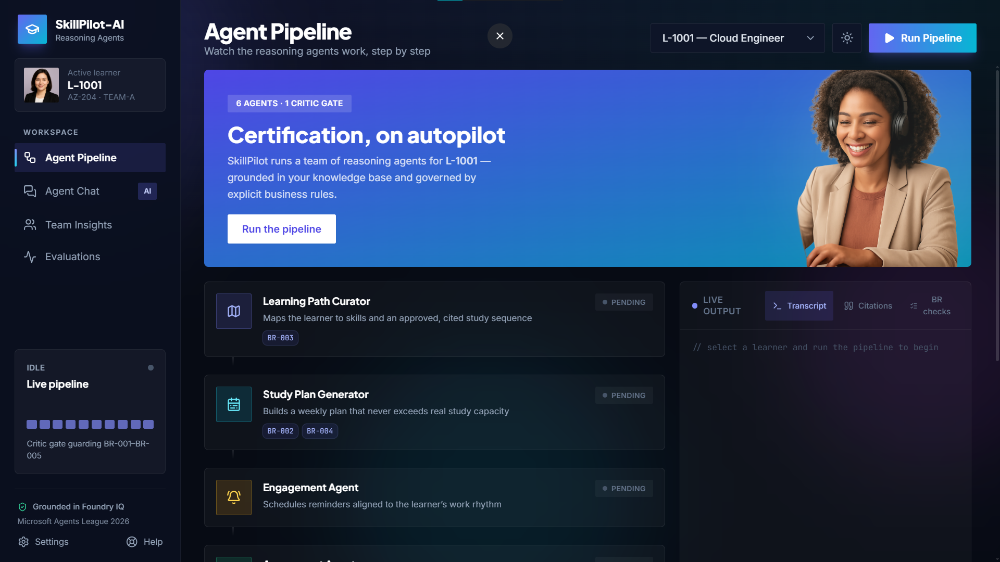
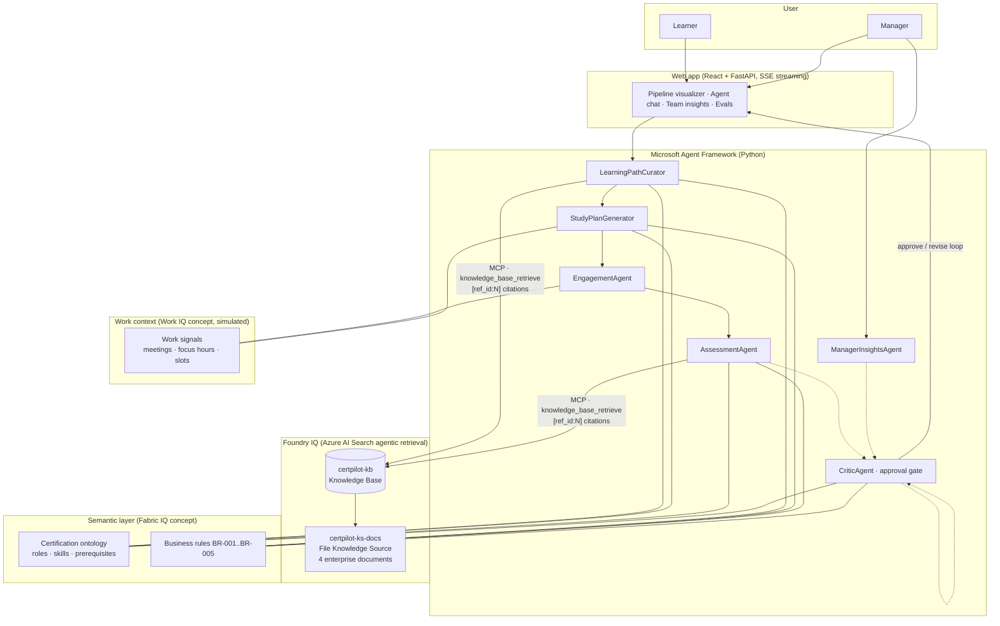
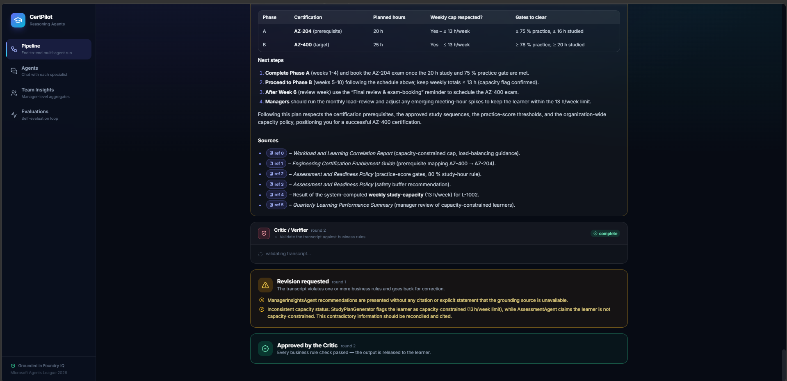
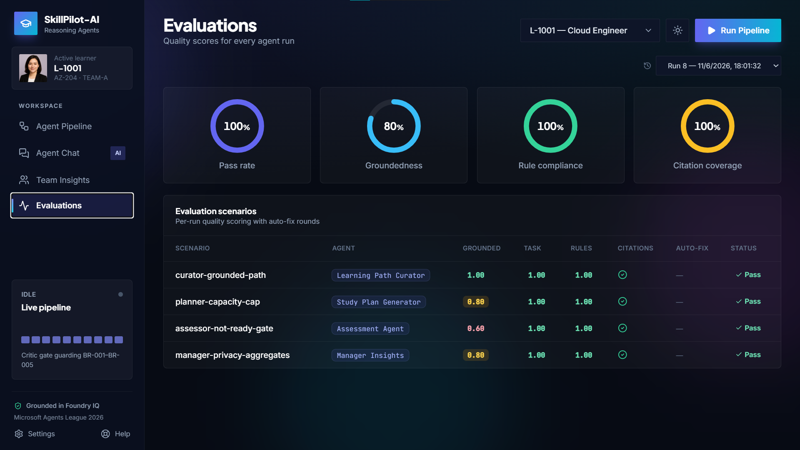
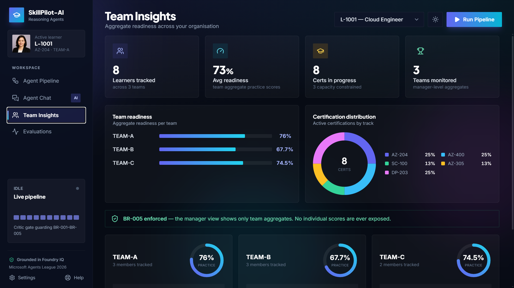

# SkillPilot-AI — Reasoning Agents for Enterprise Certification

> Microsoft Agents League · Battle #2: Reasoning Agents with Microsoft Foundry

*Your skills pilot — grounded, validated, approved.*

SkillPilot-AI is a multi-agent system that takes an employee from *"I want to get certified"*
to *exam-ready* — with every recommendation grounded in approved knowledge, every plan
validated against business rules, and every answer gated by a critic before it ships.



## Why this matters

Enterprises spend millions on certification programs with low completion rates. The
failure mode is always the same: generic study plans that ignore real workload, no
feedback loop after practice exams, and managers with zero visibility. SkillPilot-AI fixes
the three at once with specialized reasoning agents that share one grounded brain.

## Architecture



### The six agents

| Agent | Responsibility | Key constraint it enforces |
| --- | --- | --- |
| **LearningPathCurator** | Maps learner → certification → skills → approved sequence | Citations required; no Expert cert without prerequisites (BR-003) |
| **StudyPlanGenerator** | Week-by-week plan with milestones and checkpoints | Never exceeds computed study capacity (BR-002/BR-004) |
| **EngagementAgent** | Reminders aligned to real work rhythm | Never schedules over meeting-heavy windows; privacy-conscious |
| **AssessmentAgent** | Readiness verdicts + grounded practice questions | Applies the 75%/78% gates (BR-001); 40/40/20 difficulty mix |
| **ManagerInsightsAgent** | Team-level readiness dashboards | Aggregates only — never individual raw scores (BR-005) |
| **CriticAgent** | Reviews every transcript before it reaches the user | JSON verdict; triggers a revision loop on violations |

### The critic gate in action

The critic reviews the full multi-agent transcript against the business rules. When it
finds violations it sends the output back for revision — and approves only once every
check passes. This is a real run, not a mockup:



### Foundry IQ integration (the grounding layer)

The four synthetic enterprise documents (certification guide, assessment policy,
quarterly learning report, workload insights) are ingested into a **File Knowledge
Source** — no storage account, no indexer to manage. A **Knowledge Base** fans out
agentic retrieval over them, and the agents consume it through the KB's native
**MCP endpoint** with the `knowledge_base_retrieve` tool:

```
https://<search>.search.windows.net/knowledgebases/certpilot-kb/mcp?api-version=2026-05-01-preview
```

Agents must preserve the `[ref_id:N]` citations the retrieval returns — an answer with
uncited grounded claims is rejected by both the CriticAgent and the eval harness.

### Self-evaluation loop

`python -m skillpilot_ai.evals` runs four scenario cases through the live agents and scores
each answer on the Foundry evaluator taxonomy:

- **groundedness** (LLM judge vs. the approved documents + live tool data)
- **task_adherence** (LLM judge)
- **rule_compliance** (LLM judge with BR-001..BR-005 in context)
- **citation_coverage** + **deterministic checks** (capacity cap respected, not-ready
  verdicts stated, no privacy leaks) — pure code, no LLM

Failing answers trigger an **auto-correction round**: the agent gets the rejection
reason and re-answers. Every run is appended to `evals/results.json` and rendered in
the web dashboard:



### Privacy by design

Manager-facing views only ever see team-level aggregates (rule BR-005). The Critic
rejects any output that leaks an individual score:



## Repo layout

```
data/
  knowledge/        4 synthetic enterprise docs → Foundry IQ knowledge source
  ontology/         semantic model: certifications, roles, skills, business rules
  synthetic/        learner profiles + simulated Work IQ signals
src/skillpilot_ai/
  agents.py         the six agents + Foundry IQ MCP tool factory
  tools.py          function tools (readiness rules, capacity, team aggregates)
  semantic.py       rules engine over the ontology (Fabric IQ concept)
  context.py        learner / work-signal store (Work IQ concept)
  main.py           end-to-end flow with critic approval gate (CLI)
  evals.py          self-evaluation harness with auto-correction
scripts/
  setup_knowledge_base.py   one-time Foundry IQ provisioning
  test_kb_retrieve.py       KB smoke test over raw MCP JSON-RPC
  devui.py                  Agent Framework DevUI launcher
app/
  server.py         FastAPI backend: SSE pipeline streaming, chat, insights, evals
  web/              React + Tailwind frontend
hosted-agent/       azd-deployable hosted agent (Foundry Agent Service)
```

---

## Quickstart — run it on a fresh machine

### Prerequisites

| Tool | Version | Used for |
| --- | --- | --- |
| Python | 3.12 | agents, backend |
| Node.js + npm | 20+ | building the web frontend |
| An Azure subscription | — | Foundry models + Azure AI Search |
| Azure Developer CLI (`azd`) | latest | *(optional)* hosted agent deployment |

You need two Azure resources (both fit in free/student tiers):

1. **A Microsoft Foundry project** with two model deployments:
   - a chat model (we use `gpt-oss-120b`, any OpenAI-compatible chat deployment works)
   - an embedding model (we use `text-embedding-3-small`)
2. **An Azure AI Search service** (free tier is enough) for the Foundry IQ knowledge base.

### 1. Clone and install

```powershell
git clone <your-fork-url> skillpilot-ai
cd skillpilot-ai

# Python environment
python -m venv .venv
.venv\Scripts\Activate.ps1          # Linux/macOS: source .venv/bin/activate
pip install -r requirements.txt

# Frontend build
cd app\web
npm install
npm run build
cd ..\..
```

### 2. Configure credentials

```powershell
copy .env.example .env
```

Open `.env` and fill in every value:

| Variable | Where to get it |
| --- | --- |
| `AZURE_AI_PROJECT_ENDPOINT` | Foundry portal → your project → Overview |
| `AZURE_OPENAI_ENDPOINT` | same page — the OpenAI-compatible endpoint, ends in `/openai/v1` |
| `AZURE_AI_API_KEY` | Foundry portal → your project → API keys |
| `AZURE_AI_MODEL_DEPLOYMENT` | name of your chat model deployment (e.g. `gpt-oss-120b`) |
| `AZURE_AI_EMBEDDING_DEPLOYMENT` | name of your embedding deployment |
| `AZURE_SEARCH_ENDPOINT` | `https://<your-search-service>.search.windows.net` |
| `AZURE_SEARCH_API_KEY` | Azure portal → search service → Keys → primary admin key |

> The `.env` file is gitignored — secrets never reach the repo.

### 3. Provision the Foundry IQ knowledge base (one time)

```powershell
python scripts\setup_knowledge_base.py
```

This creates the knowledge source, uploads the four documents from `data/knowledge/`,
waits for ingestion, and creates the knowledge base. Verify retrieval works:

```powershell
python scripts\test_kb_retrieve.py
```

### 4. Run

**Web application** (recommended — everything in one place):

```powershell
python -m uvicorn app.server:app --port 8000
# open http://127.0.0.1:8000
```

**CLI pipeline** (the same flow in the terminal):

```powershell
$env:PYTHONPATH='src'                # Linux/macOS: export PYTHONPATH=src
python -m skillpilot_ai.main L-1001
```

**Self-evaluation loop**:

```powershell
$env:PYTHONPATH='src'
python -m skillpilot_ai.evals
```

**Agent Framework DevUI** (developer tooling view):

```powershell
python scripts\devui.py
# open http://127.0.0.1:8090
```

### 5. (Optional) Deploy the hosted agent to Foundry Agent Service

Requires `azd` and a Foundry project in a [region that supports hosted agents](https://learn.microsoft.com/azure/ai-foundry/agents/concepts/hosted-agents):

```powershell
cd hosted-agent\skillpilot-ai-sample-agent
azd auth login
azd env set AZURE_OPENAI_BASE_URL "https://<resource>.openai.azure.com/openai/v1"
azd env set AZURE_AI_API_KEY "<key>"
azd env set AZURE_SEARCH_ENDPOINT "https://<search>.search.windows.net"
azd env set AZURE_SEARCH_API_KEY "<key>"
azd up

azd ai agent invoke skillpilot-ai-sample-agent '{\"input\": \"Is learner L-1001 ready to book the AZ-204 exam? Check the readiness rules and cite the policy.\"}'
```

### Troubleshooting

| Symptom | Fix |
| --- | --- |
| `UnicodeEncodeError` in Windows terminal | `$env:PYTHONIOENCODING='utf-8'` before running |
| Empty model answers (intermittent with `gpt-oss`) | already handled — agents retry up to 3 times |
| `answer-synthesis KB failed` during setup | expected without GPT-family quota; the script falls back to extractive mode and agents do the cited synthesis |
| Agents answer "grounding unavailable" | check `AZURE_SEARCH_*` values and that step 3 completed |

## Azure footprint

| Resource | Purpose |
| --- | --- |
| Foundry project | Models: `gpt-oss-120b` (reasoning) + `text-embedding-3-small` |
| Azure AI Search free tier | Foundry IQ knowledge base + knowledge source |
| Foundry project (hosted-agent region) | Hosted agent deployment via `azd` |
| Azure Container Registry | Hosted agent images (created by `azd up`) |

All data is **synthetic** — every document and record carries an explicit disclaimer.
No real employee, customer, or company data is used anywhere.
